<p float="left">
 <a href="https://www.dataumbrella.org" target="_blank">  </a>
  
   <a href="https://github.com/scikit-learn" target="_blank">   </a>
</p>


# [Data Umbrella](https://www.dataumbrella.org): Crash Course in Contributing to [scikit-learn](https://github.com/scikit-learn)

## Video Transcript
- Speaker:  [Andreas Mueller](https://twitter.com/amuellerml)
- Video:  [Scikit-learn Sprint Instructions](https://youtu.be/5OL8XoMMOfA)
- Duration: 30 minutes
- Transcriber: [Reshama Shaikh](https://twitter.com/reshamas)

## Key Links
- Data Umbrella [Discord](https://discord.gg/mEzEbYT)
- Gitter: [scikit-learn](https://gitter.im/scikit-learn)
- **[Contributing Workflow Commands](contributing/workflow.md)** (environment set-up, repo, submitting PR)

## Video
<a href="https://youtu.be/5OL8XoMMOfA?t=1">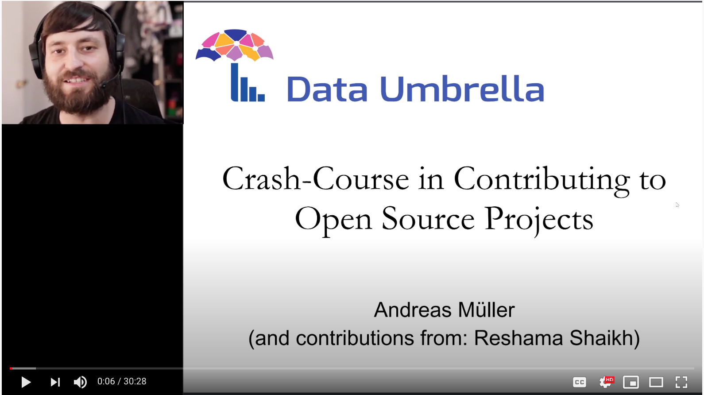</a>

---

### Slide 1: Intro (0:00)
<a href="https://youtu.be/5OL8XoMMOfA?t=1"></a>


Hey everybody, so this is an instruction video on how to contribute to source projects, in particular to scikit-learn.  I'm Andreas Mueller, one of the core developers of the scikit-learn project.  Thanks for Reshama and Data Umbrella for organizing this sprint.  So I really want to give you just a very brief overview of the technology behind contributing to open source and the steps of getting your first contributions in.  

### Slide 2: Instructions for Sklearn (0:40) 
<a href="https://youtu.be/5OL8XoMMOfA?t=40" target="_blank">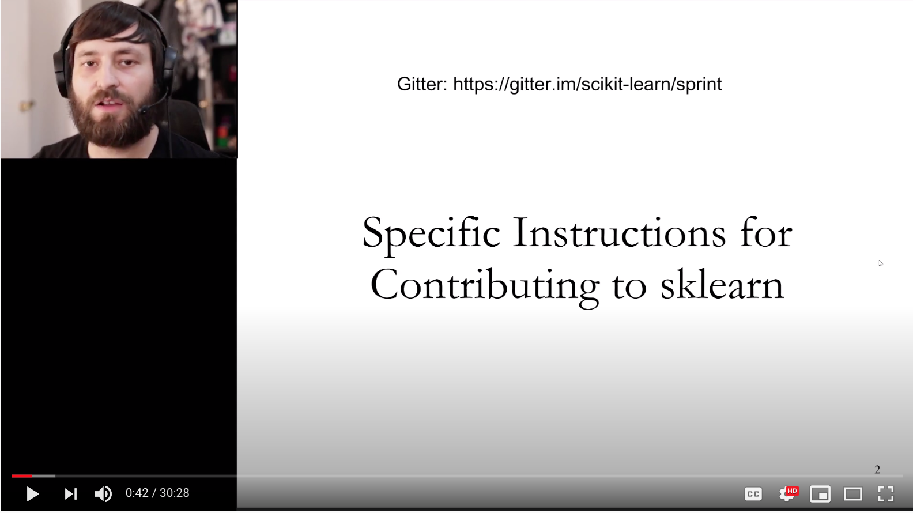</a>


So first off, a great way to communicate with the developers is the Gitter channel.  You can find that at [gitter.im/scikit-learn](https://gitter.im/scikit-learn). For the sprint, there is a channel called "sprint":  [gitter.im/scikit-learn/sprint](https://gitter.im/scikit-learn/sprint).  And there is also a scikit-learn channel that's just a general channel: [gitter.im/scikit-learn/scikit-learn](https://gitter.im/scikit-learn/scikit-learn).  During the sprint we will also use a Discord and so during the sprint Discord might be the best way to communicate.  But after the sprint ends, the core developers will probably not be staying around on the Discord, but you can always go to the Gitter channel for help.

### Slide 3: Reasons to Contribute (1:24)
<a href="https://youtu.be/5OL8XoMMOfA?t=84" target="_blank">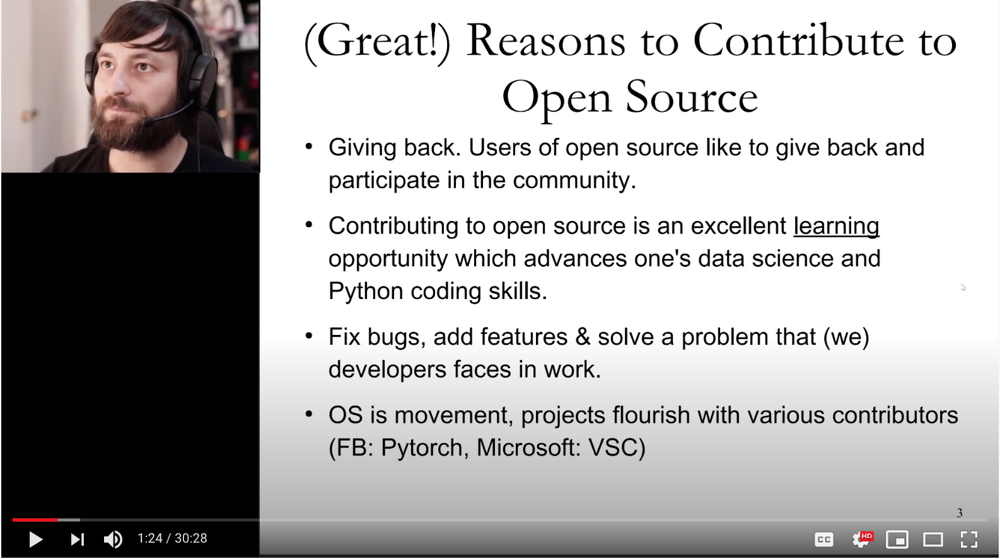</a>


So, you already joined us and, or at least you're looking at this video. So I hope you're already highly motivated to start contributing. Still I want to go over a couple of reasons you might want to contribute. For a lot of people it's about giving back to the projects that
they're already using.  So the users of projects are usually the best contributors.  And so hopefully open source projects already have helped you in your coding journey and your job and so on. And contributing back is a great way to give back to the community.  It also gives you a great opportunity to learn from the other people involved in a project which are often senior developers which will give you feedback about like coding style and also on how to use the different projects and how to interact.  It also allows you to address issues
that have always been bothering you about library, like fix things, fix documentation and just make the projects better. 

### Slide 4: Reasons to Contribute (2:33)
<a href="https://youtu.be/5OL8XoMMOfA?t=153" target="_blank">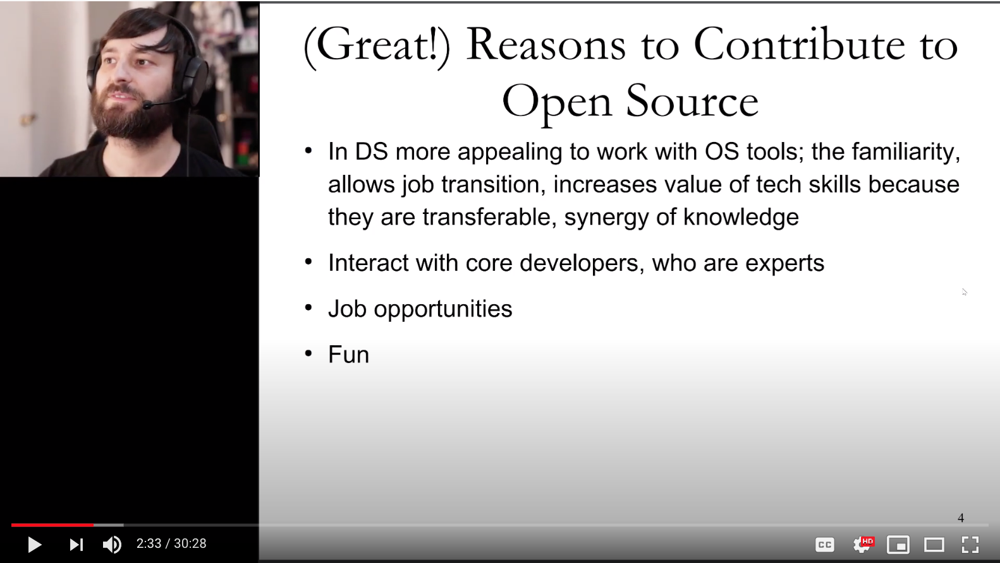</a>


Also it'll just get you more familiar with data science tools if you're directly contributing to projects.  Definitely contributing to open source could also be helpful in looking for jobs, though if this is your own only motivation, it might not work out so well because
open source is really about the community.  And unless you're really interested in the project you probably won't be able to stick around for too long.  So really what we were mostly in for is giving back your projects, interacting with the other contributors, and just having fun working on the projects.

### Slide 5: Set up Python environment (3:16)
<a href="https://youtu.be/5OL8XoMMOfA?t=196" target="_blank">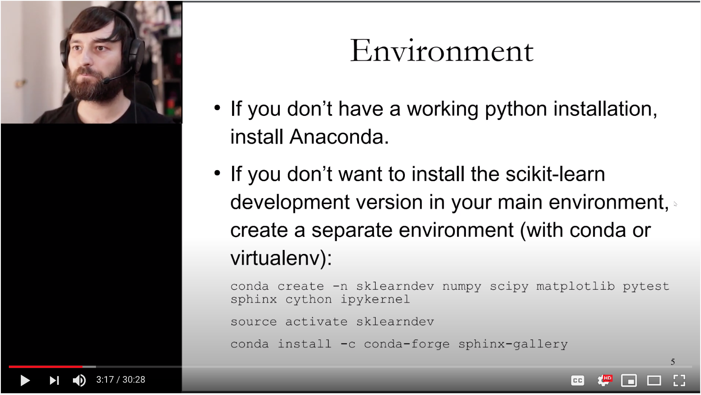</a>
 
So now let's get to the technical part. So first want to talk about the set up.  If you want to develop a Python project, obviously you need to first have a local installation.  And so if you already have a working Python environment that's fine. If not I would say just install Anaconda. It's usually the easiest way to go.  If you have a working environment already, make sure you're not using the system Python in OS X, but that you're using a separate environment to do your development in. If you already have an Anaconda installation, just create a separate virtual environment for the sprint.  

So I give the command here which is `conda create -n` and I gave it a name for the environment, here call it `sklearndev`.  And then all the packages that it will depend on: `numpy scipy matplotlib pytest sphinx cython ipykernel`.  So, we're actually not installing scikit-learn using conda. We're going to install the development version.  And so then you can activate this environment using `source activate sklearndev` or `conda activate sklearndev`, I think on Windows mostly.  

```bash
conda create -n sklearndev numpy scipy matplotlib pytest sphinx cython ipykernel
source actviate sklearndev
conda install -c conda-forge sphinx-gallery
```
Then, if you want to work on documentation, you also need to install the sphinx-gallery package.  This is not on main conda so you need to install it from the conda-forge channel using `conda install -c conda-forge sphinx-gallery`.


### Slide 6: Fork sklearn on GitHub (4:57)
<a href="https://youtu.be/5OL8XoMMOfA?t=297" target="_blank">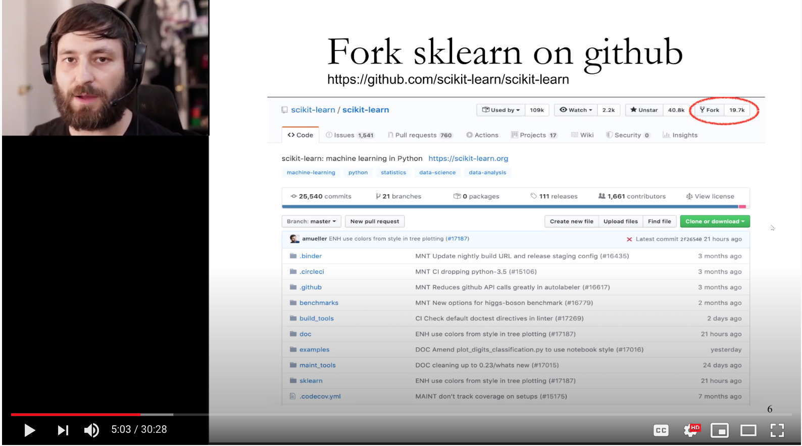</a>

All right, so now you have your python environment setup.  You have a separate environment for scikit-learn development. Now you're going to get the newest development version of scikit-learn.  To do this, first you go to the main scikit-learn repository github.com slash scikit-learn, slash scikit-learn:  [github.com/scikit-learn/scikit-learn](https://github.com/scikit-learn/scikit-learn) and you'll create a fork. The fork is basically your own personal copy of the repository on GitHub. 


### Slide 7: Clone the Fork (5:26)
<a href="https://youtu.be/5OL8XoMMOfA?t=326" target="_blank">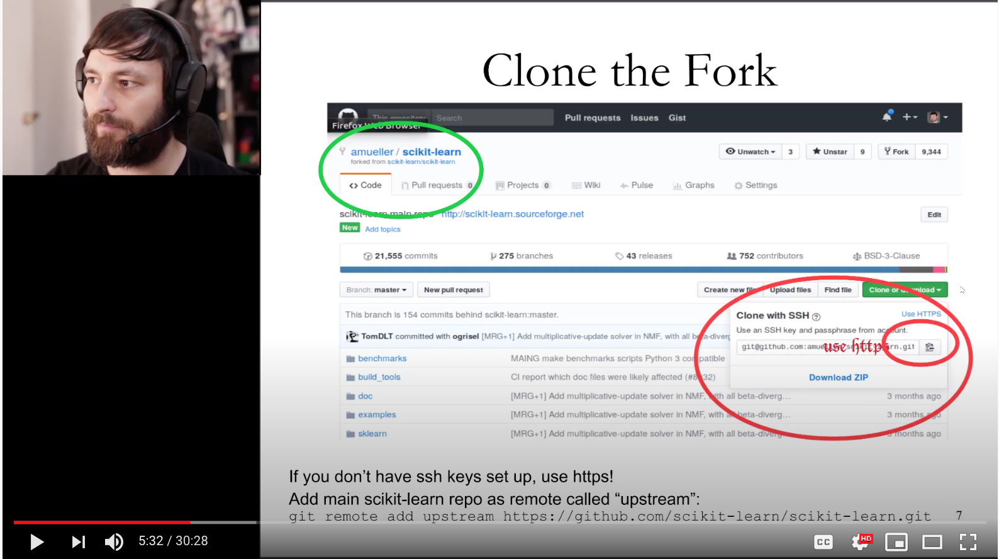</a>

You can do this by clicking the fork button on the top right here.  This will create your personal fork and will take you there. So you can see here top left this is my fork, amueller slash scikit-learn. Amueller is my GitHub handle, so you'll have your GitHub handle there. And you can see it's a fork of scikit-learn slash scikit-learn, the main repository.  

#### (5:50)
So this is now your own private copy on GitHub. So this copy, you have write access to and you can make changes on this.  From there, you'll get your own local copy on your own machine by cloning it. And so there's this green button clone or download that you can see here.  You click on this and you can copy the link and do `git clone` with this URL. And this will download a copy to your local machine, your laptop, or PC. When you do this, one thing that's important is that you use HTTPS.  So you click here and you should use HTTPS and you'll get an HTTP address.  I'm using SSH which is easier if you have SSH keys set up up on your local machine.  If you don't
have SSH keys set up and you haven't put them in your GitHub account and so on, then just use HTTPS.  It's gonna be much
easier.  Once you downloaded the repository from your clone, you also want to add the main repository as an upstream so you can download the newest version from the upstream repository if someone else makes changes.  You can do this within your repository by doing `git
remote add upstream` and then the URL after my repository, github.com slash scikit-learn slash scikit-learn dot get:  https://github.com/amueller/scikit-learn.git

### Slide 8: Build and run tests (7:25)
<a href="https://youtu.be/5OL8XoMMOfA?t=443" target="_blank">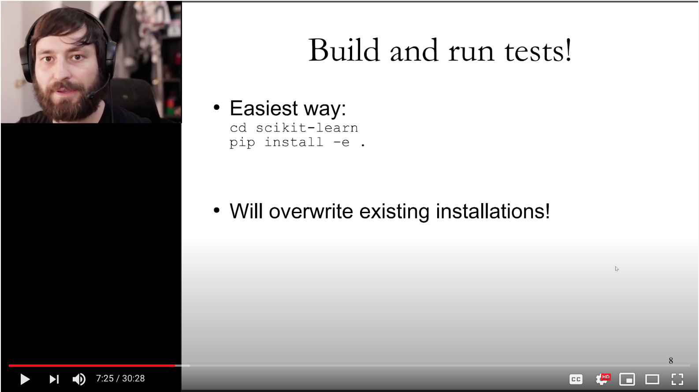</a>

Alright, so now you have your local copy of the scikit-learn development version and now we want to install it. So we want to build it and install it.  And the easiest way is to go to the folder that you just cloned and do pip install - e dot: `pip install -e .`  This does an
installation which does the building and we'll add it to your Python path.  The - e makes it an edible installation, editable (not edible),  editable installation. Which means that if you change files in this folder, it will be automatically reflected in your installation.  This will overwrite existing installations, so make sure you don't have an installation of scikit-learn. So make sure you do `conda uninstall scikit-learn` in this environment if you accidentally installed it earlier.  

#### Windows (8:14)
If you're on Windows to install it, you will need a C++ compiler so you need to install the Visual Studio toolkit. And if you try to
do a pip install - e dot, it'll probably give you an error message.  The error message will tell you exactly what to download and where.  For OS Access Linux, you'll have compiler probably already installed so you don't need to worry about that.  So then you have your build installation, your fresh installation from the development branch of scikit-learn.

### Slide 9: Starting on Issues (8:50)
<a href="https://youtu.be/5OL8XoMMOfA?t=530" target="_blank">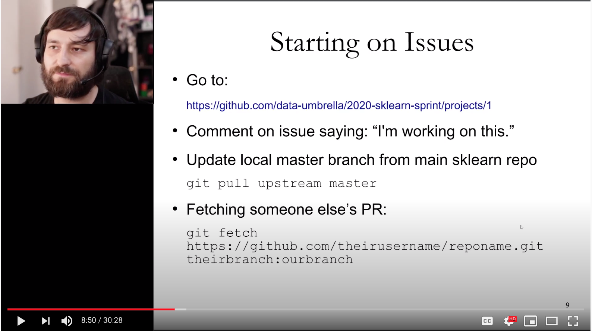</a>

Now you have to pick an issue to get started on so I'll talk a little bit more about this later but we selected some of the issues so it might be easiest to pick one of these issues.  You'll find a URL here. Hopefully you download the slides so you don't have to type all of this.  Then comment on the issue, say "I'm working on this" or there's also a command now where you can just say "take" and the bot will assign the issue to you.  Before you get started working, make sure your you have the very current version of the upstream master, so off the main repository.  You can do this by doing `git pull upstream master`.  This is why we added the upstream repository earlier 

#### fetch someone else's PR (9:38)
If you want to start from someone else's pull request, where they already started some work but then stopped, and then you want to finish it off, you can get their code using this git command down here get fetch and then add a url to their repository and then their branch name, colon, whatever branch name you want to use locally.  

`git fetch https://github.com/theirusername/reponame.git theirbranch:ourbranch`

### Slide 10: Starting on Issues (9:59)
<a href="https://youtu.be/5OL8XoMMOfA?t=600" target="_blank">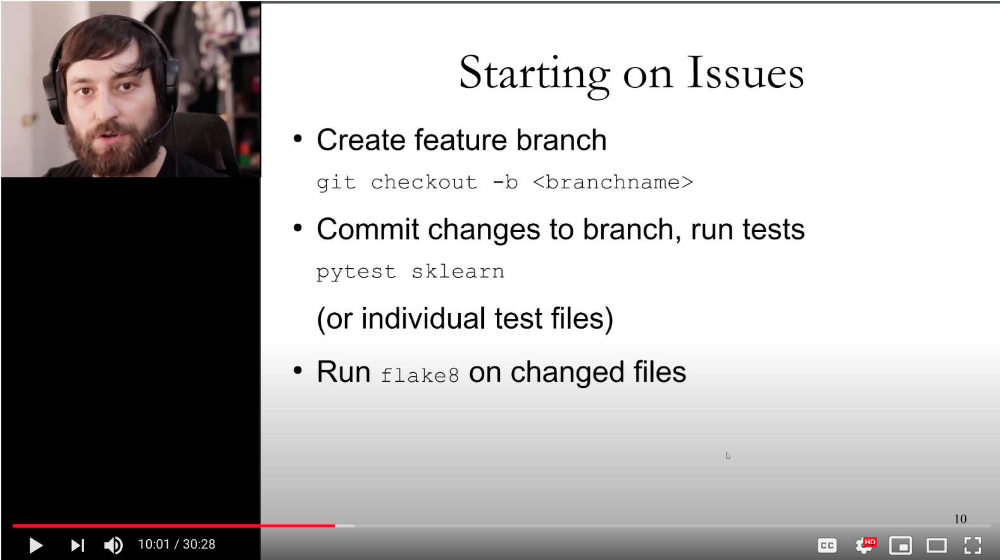</a>

So before you start coding, you want to create a new branch for your feature.  You can can do this by doing git checkout dash b (`git checkout -b <brachname>` ) and then a name for your branch.  

You shouldn't work on your master branch.  You shouldn't make changes to your master branch.  You should always work on a feature branch. 
So for example if you want to improve the documentation for random forests, you might do get check out - b  random forests underscore docs or something like this (`git checkout -b randomforests_docs`).  This is mostly for you, but it's useful if it has like an understandable name.  

Then you make your changes. We'll talk a little bit more detail about that. So you fix some bugs or improve the documentation, whatever
you want to do. Then you run the tests with `pytest sklearn`. `pytest sklearn` will run all of the tests. You can also run just individual test files if you want.  And finally run flake eight (`flake8`) on all the changed files. So flake8 is a linting tool.  It will show you formatting errors and like unused statements and so on.  If you don't do this, there are probably problems later, in the continuous integration, and you'll definitely have to fix them before we can merge your pull request. 

### Slide 11: Creating a PR (11:20)
<a href="https://youtu.be/5OL8XoMMOfA?t=680" target="_blank"></a>

So now, let's say you fix the issues you want to fix.  You committed them locally on your branch and you run the tests and you run flake8 and everything passes.  Then you can push the changes you made locally to your GitHub repository using git push origin and then the name of your branch.  This pushed it to your fork for you, so to your personal copy of scikit-learn on GitHub.  Then to get it into the main repository, you do what's called a pull request, which basically asks the developers to take your changes and integrate them in the main repository.  You can create a pull request by going onto the main repository scikit-learn slash scikit-learn, and if you push to your repository, you will see this green button here saying compare and pull request. 

### Slide 12: Describing PR (12:17)
<a href="https://youtu.be/5OL8XoMMOfA?t=739" target="_blank">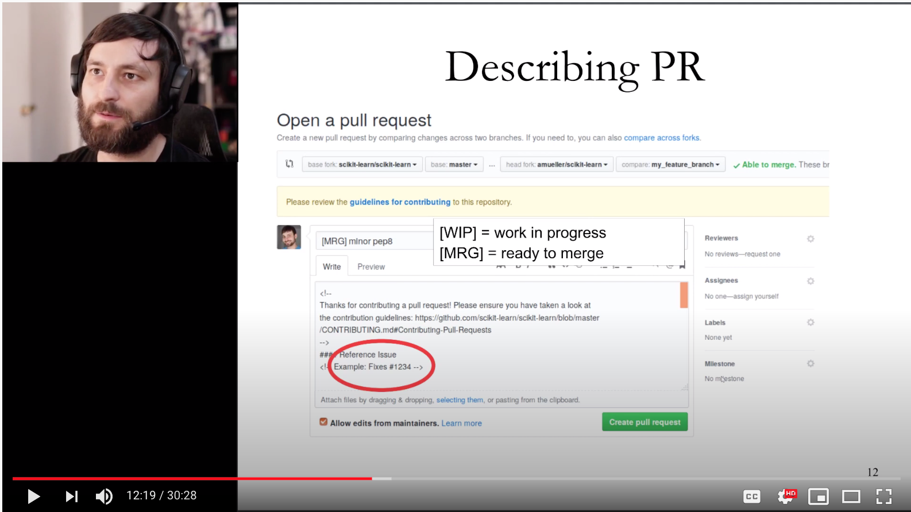</a>

So this will take you to an interface where you can create a pull request.  It will automatically fill in the things here at the top which will basically say from your fork, your branch, you want to do a pull request to scikit-learn master branch. But that will usually be automatically filled in for you.  What you have to do is first you have to give it a title. If you want you can preface the title by either MRG, if you think your work is ready to be reviewed and merged.  Or WIP if you think it's a work in progress, meaning you still need to want to make some changes. You just want to show off the work you've done so far. You usually want to give this a descriptive name, so something that someone can read and they know exactly what you're working on. And so remember scikit-learn is big and so if you say change and classes attribute, and you don't saying which model is is in, this might not be super useful.  So be precise and specific, but don't make it too long. If you reference an issue that you're fixing in the title, GitHub will actually not link it.  But so it's very important that you reference any issue, that you're fixing or that you write it to or any pull requests you're taking over, in the description of the pull request. So here, here you want to say "Fixes issue x".  There are actually some magic words on GitHub that mean that if you say "Fix x" or "Closes x", and then the pull request is merged, GitHub will automatically close it as a pull request. So if you're completely fixing something that is an issue, say "fix this issue" and then the pull requests will be automatically closed.  If you're fixing only part of an issue, or if your issue has like many small parts, and you're doing one of them, please don't say "fixes issue" or "closes issue" because then if your thing gets merged, GitHub will automatically close the whole issue for everybody.  And then someone else needs to reopen it if it's current.  So use the fixes issue number, but only when it's appropriate and definitely definitely mention any issue or pull requests that's related. 

**Addendum:**  May want to use "References issue #xxxxx" (instead of "fixes" or "closes")

### Slide 13: Regression Tests (14:45)
<a href="https://youtu.be/5OL8XoMMOfA?t=887" target="_blank"></a>


All right, so let's say you opened your pull request.  Then at the bottom of it you will see the continuous integration suit running. So the diagrams will be a little bit different these days because we're mostly using Azure pipelines.  And so you want all of these to be green checkmarks.  If not, then you can click on details and it'll tell you why the test is failing.  And this will hopefully tell you
what you need to address.  If this is unclear to you, just ask a question on the pull request or on the issue tracker anywhere and people will be happy to help you to clarify what it is that you need to fix for a test to pass. 

Also it's not enough that the tests that were there before passed.  Whenever you change the code, you also want to add a test that tests the code that you added.  If you fix the bug that's called a regression test.  But also if you add a feature, you definitely want to add a
test that tests the feature.  We won't merge any pull requests without a test.  And so basically if you made any change to the code at all, it's very likely you also need to make a change to your tests or make an addition to the tests.  If you don't know which test file to look at, you can probably do a git grep to find it.  Not just ask which file it has to go into or what should be tested. 

### Slide 14: What's Next? (16:15)
<a href="https://youtu.be/5OL8XoMMOfA?t=975" target="_blank">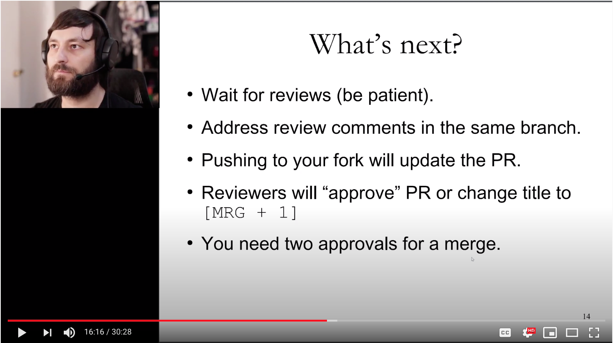</a>

All right so let's say you edit your tests.  All the tests pass.  Everything is green. What's next?  Then you will get reviewers from the
core developers probably.  It might take some time, particularly during the sprint, because people are quite busy. Usually reviewers will have comments.  It's very unusual that someone will say "oh your pull request is great, we can just merge it." The pull request reviews is a really, really important part of open source, and it's the main way that new features are discussed. So don't be disappointed if someone says "well I actually think we should do it this way or that way." This is really the main way the developers communicate. And so it's not like they're rejecting your pull requests.  Basically, every pull requests undergoes changes.

I've been with the project for a long time and basically any pull requests that I do will have a long discussion and will undergo many iterations before it gets merged, *if* it gets merged.  And so if you're less familiar with the project, it will probably take even more iterations.  And so that's just completely normal and it's the way that you'll learn about the practices in the project and also how
you learn to improve your coding style.  To address any comments, you can just update the branch you have locally and push to your fork.  That will automatically update the pull request. So you don't need to close the pull request and open a new pull request.  The pull request will automatically update with any changes you have. This will probably go back forth a couple of times and then once the reviewers are happy, they'll approve the pull request or maybe change the title to merge plus one ([MRG + 1]).

But I think these days we usually use the GitHub approve feature.  You need two approvals from scikit-learn core developers so these are people with commit rights on the scikit-learn repo.  Once you have two approvals, your pull request probably gets merged.  It might sometimes take some time to get reviews so please be patient.  But you can also feel free to ping issue and ask for reviews.  So to ping developers on your pull request or in a chat or in person. Well, in person is hard these days but like in whatever online platform we were collaborating. 

### Slide 15: Finding Issues  (18:52 )
<a href="https://youtu.be/5OL8XoMMOfA?t=1132" target="_blank">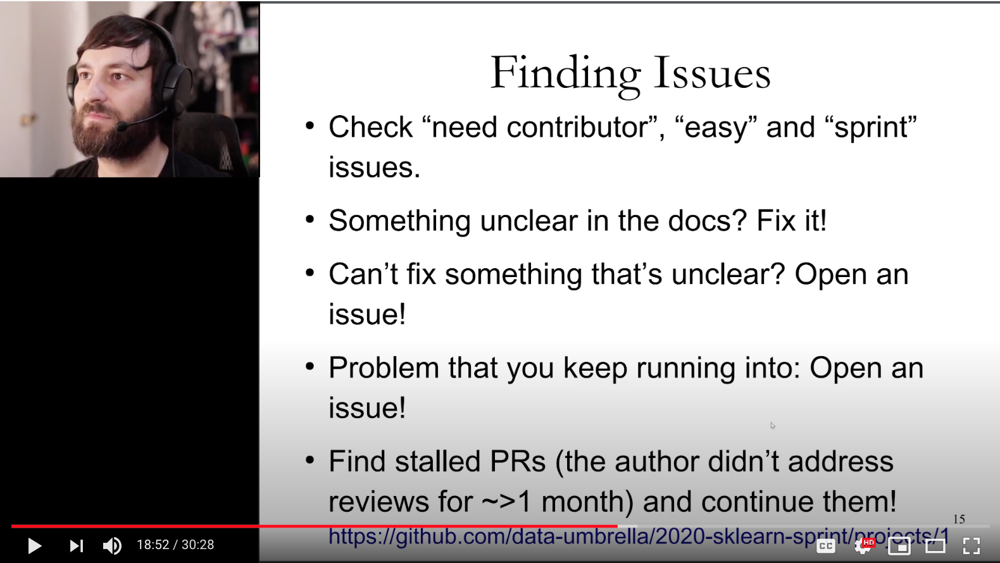</a>

One aspect that I think is quite important is finding issues to work on. So ideally you find something that you're interested in but you should also start with something that's really, really simple.  If this is your first open source contribution or even if it's your
first contribution to the scikit-learn project; even if you have contributed to other projects before, *really* start with something super simple. As you might have noticed there's a lot of process to all of this like working with Git, working with the continuous integration working with the reviewers, and so on.  And so even if it's just a single line code change or a single line documentation change, it can be really useful.  And it's important to do a small thing to get up to speed and get it merged.  Before you attack anything big, still just do something simple first.  

As I said before there's this thing that's linked here at the bottom where we put we put some issues that are specifically we marked for this sprint.  So these are probably all quite good.  Other than that there's tags on the repository.  The most important tag is
maybe a good first issue.  "Good first issue" issues are good if you haven't contributed to scikit-learn before and that should be pretty easy and straightforward.  Things that need someone to work on them should be tagged with "need contributor" though that might sometimes be outdated. But you should check things that are good first issue and need contributor.  

There are also things that are marked easy or sprint.  So easy are those that are easy but maybe not great for first contributors or sometimes they may have both tags.  

So there's also other ways to contribute then finding an issue and working on them.  You can also just fix something in the docs that's unclear.  You don't necessarily need to open issue for this, so just like improve the documentation if there's something you don't like about it.  Or just open issues. Open issues about unclear docs, about features that you find weird, about examples that are not helpful, about bugs you run into.  

So a sprint can be a really great opportunity to open issues about things that you don't like about the projects, problems that you run into. And having this feedback is really, really important to improve the project.  

Another thing you can do is find pull requests that someone else made but didn't finish.  So if there was reviews by the developers but then say after a month or two people didn't come back and address their issues, usually we assume the issue is up for grabs. It's polite to ask but they might not have time to answer you in the time it takes for this, like in the one day of the sprint. So either just ask
say "are you still working on this?" or in some case it might be fine just start working on it and say okay itlooks like you're not working on this anymore I'll take it over.  

In this and any other communications on the issue tracker of course always be nice, be courteous, be productive and constructive in your feedback.  

### Slide 16:  Reviewing (22:22)
<a href="https://youtu.be/5OL8XoMMOfA?t=1342" target="_blank"></a>

You can also start reviewing.  In particular reviewing pull requests or issues opened by other people at the sprint might be
useful because they're usually at a more introductory level.  But you can try to review any pull requests and issues. Reviewing issues might be a little bit more straightforward. So if you want to check an issue one may seek:  
- is this issue reproducible? 
- is it clear what the person is reporting?
- did they give the minimum reproducible example?
- if so, can you reproduce it on your machine?
- did they provide data?
- if they couldn't provide the data, could they reproduce it with an hypothetical example?

And so these are sort of all the things that need to be present.  If they're not present, you can ask the person who opened the issue
to provide them.  If something's not clear about the issue, also feel free to clarify or like ask for clarification I mean.  And then you can try to reproduce the issue. So just reproducing it and making sure it's easy to reproduce it, it's already quite helpful. Some of the issues might already be fixed and so you can say oh this is already been fixed in this in this version because we have very old issues going back several years.  So triaging issues is a very useful thing to do.  Some bugs are not confirmed so you see if you can confirm it and under which conditions.  

You can also review pull requests make those for documentation on whether they're clear. Is the language clear? You can also review code changes. Either on like do they have teststs added? Do they adhere to the styles? Does continuous integration pass? And then maybe did they mention the issue they are addressing in their description?  So all of the things that I said you should do for your pull request, you could check, are the other people in the sprint or generally anyone that has a pull request.  Are they adhering to these standards? If not, you can ask them to do it.  Of course, always be nice and polite.  You can also try to review code changes to see are they actually addressing the thing that they want to address? And are they addressing it in a way that you think is good? This might be a little bit more tricky but you should definitely give it a go.  And if something is unclear just ask for clarification. And also don't be hesitant to provide feedback.  Just always be like polite in saying, like oh maybe I would have done it this way, is there reason you do it this way, and not say don't say like oh this is a bad way to do this you, should do it this way.  There's probably a reason someone did it the way it did so just always be nice and just or the ask for clarification instead of assuming.

### Slide 17:  Workflow Reminders (25:25)
<a href="https://youtu.be/5OL8XoMMOfA?t=1524" target="_blank">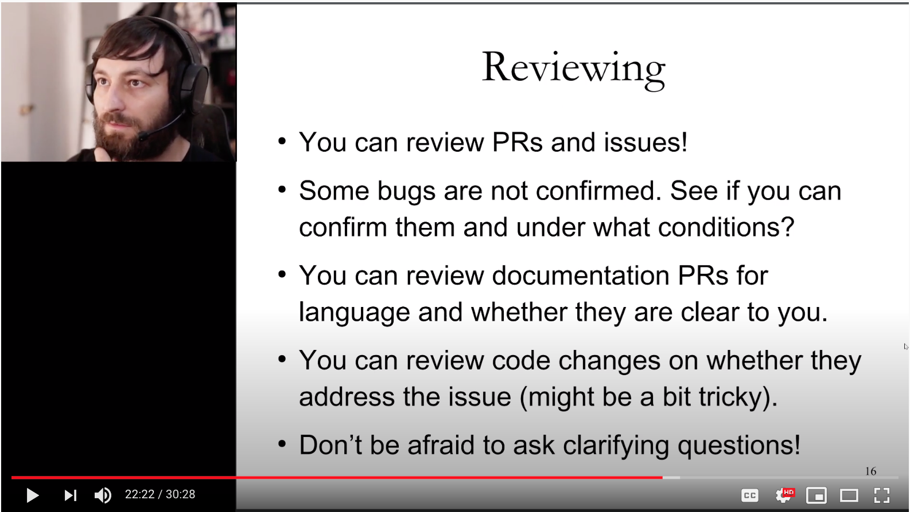</a>

A couple of things on the workflow during the sprint. So you're highly encouraged to do pair programming. I find it's much more fun and you can get much more done during pair programming.  This time around it will be remote pair programming using Discord.  It's maybe not entirely as good as doing in-person pair programming, but I think it's still quite a lot of fun.  If you're doing a pull request or an issue just @ mention the other person that's working on it so they all get a ping in their emails. Make sure to follow up on your work. So expect there's a lot of back-and-forth and discussion and so make sure that you catch any reviews you get on your pull requests. And really it's important to ask the project for you to really get your contributions merged and so really try to get a follow up during the sprint but also ideally follow up after the sprint. Really what we love the most is finding new contributors that keep coming back to the project and keep coming back to contributing.  It will be more easy and more satisfying to contribute to the project the more you get involved and the more familiar you have become. 

You'll be able to do more and more interesting things.  You'll be able to add cool new features to the project and so on. And so it's also really a way to grow with the project and to learn much more by becoming more long-term engaged. 

So we will probably try to do some follow-up events for the sprints. Otherwise feel free to follow up on the issue tracker. The issue tracker is really the main way the developers communicate.  There's also a monthly community, monthly developer call that you can join if you want. Join the email list or just talk to us on gitter.  And so yeah make sure you know which email address you use on your GitHub account and check that email address for notifications or check the notifications directly on GitHub.

### Slide 18: Workflow Reminders (27:44)

So I said so there might be some things todo you can't finish up during the sprint. It's really great if you can follow up and get your pull requests merged. So the pull request and GitHub is really the best way to communicate and this is a public discussion where all of the core developers or really anyone else on the internet can answer question and help.  And as I said before we will using a discord during the sprint but the core developers will probably not be around on the Discord most of the time after the sprint. So a good idea is to go on the scikit-learn sprint channel or just the general scikit-learn channel or just talk in the issues and pull requests. 

So really we're emphasizing that it's a good idea to start with something really very simple as a first contribution and then work your way up from there. My first contribution to scikit-learn were fixing some typos in our documentation.  And if I start contributing to any other project, usually the first thing I do is like fix a line your documentation and just to, you know, get started with the project and start communicating and start getting into the workflow.  


### Slide 19: Final Words (29:00)

Yeah so if you want to add a  major features to scikit-learn, that's probably not something you can do in a day.  Adding a new model to scikit-learn is usually something that take many months and it's not something you should try to attempt at the beginning. So really start with something simple and then maybe if you got your first first two pull requests and you can work at adding like a smaller feature but don't count on adding a big feature anytime soon.  That is because scikit-learn is already quite a mature library and so it's moving quite slowly.  And so it's hard to add anything big or make any big new changes. Also there might be a lot of interesting issues that are not appropriately tagged.  So if you're interested in particular topic you can just search the topic on the issue tracker or on the pull requests and see if there's something interesting happening there.

### Slide 20: Thank you (29:59)

So with this I want to say enjoy the sprint and thank you all for your help and I hope you have a lot of fun, you'll learn a lot working together with your sprint partner. And I hope you'll come back for more sprints or you just keep engaging on the issue tracker. All right so, thank you so much!


