

 
  
   

# [Data Umbrella](https://www.dataumbrella.org): Andreas' Video Sprint Instructions for scikit-learn Volume 2

## Video Transcript
- Speaker:  [Andreas Mueller](https://twitter.com/amuellerml)
- Video:  [Scikit-learn Sprint Instructions: Volume 2 FAQs](https://youtu.be/p_2Uw2BxdhA) (15 minutes)
- PDF slides: [Open Source Sprint Instructions for scikit-learn](https://onedrive.live.com/view.aspx?resid=4D2D28C53EB310F1!1533&ithint=file%2cpptx&authkey=!AM7c29_RJfitJrc)
- Transcriber: [Victoria Levchenko](https://www.instagram.com/autotelic.computer/)

## Key Links
- [Contributing Workflow Commands](https://github.com/data-umbrella/data-umbrella-scikit-learn-sprint/blob/master/contributing/workflow.md)
- [Scikit-learn Contributing Documentation](http://scikit-learn.org/stable/developers/contributing.html)

## Video Updates (not `master`, but `main`)

<a href="https://scikit-learn.org/dev/developers/contributing.html">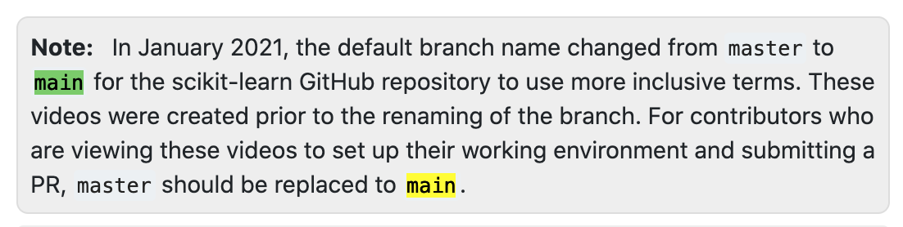</a>

## Video
<a href="https://youtu.be/p_2Uw2BxdhA?t=1">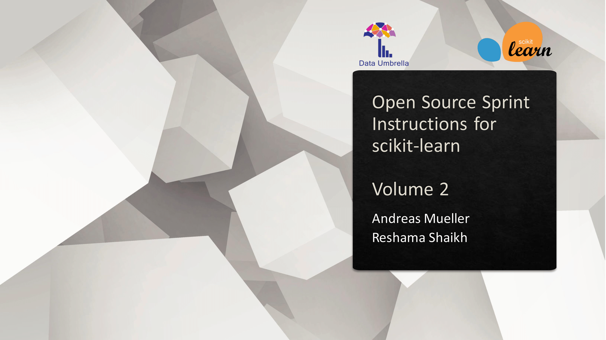</a>

---

### Slide 1: Intro (0:00)

Hi everybody, this is another video providing information about how to contribute to scikit-learn - in particular as part of an open source sprint. Reshama is organizing another sprint together with the Data Umbrella, this time with a geographical focus on Africa and the Middle East. We've gotten a lot of feedback on past sprints and I'm trying to clarify some of the points that people struggled with in our past sprints in this video here.

### Slide 2: Check Out the Basics (0:31)
<a href="https://www.youtube.com/watch?v=p_2Uw2BxdhA">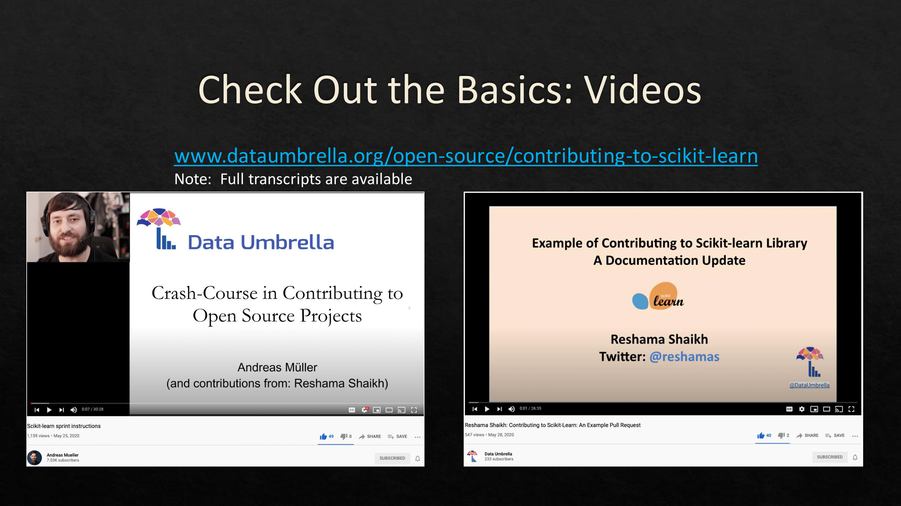</a>

If you haven't already, please check out the videos we posted before. I've given a short overview of contributing to scikit-learn
and Reshama did a whole walk through on creating your first pull request. If you're new to contributing to open source and/or to scikit-learn, I highly recommend you check out both of them.

This video here will assume that you understand the basics that we described there and we'll discuss some of the topics in more detail.

### Slide 3: Pair Programming (0:59)
<a href="https://www.youtube.com/watch?v=p_2Uw2BxdhA">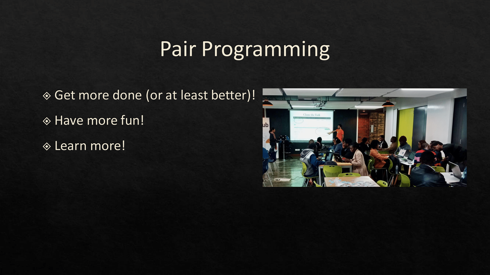</a>

First, we're pair programming. During a sprint, we highly encourage people to work in pairs using a process from Agile Development called pair programming. Pair programming is great. Pair programming is great because it allows the participants to share knowledge. It usually increases the fun of programming a lot - in particular if you're new to your codebase. It's common to struggle and having more eyes on the code often helps.

In pair programming, you have two developers working together on the same problem with one person driving who actually writes the code. The other person observes and discusses the programming with the person driving. Right now, you're likely not in the same space as the person you're coding with but online platforms like Discord allow you to easily share your screen and have a private audio channel. Being able to talk while typing the code is quite important for pair programming to be productive. 

### Slide 4: Pair Programming: TIPS (2:04)
<a href="https://www.youtube.com/watch?v=p_2Uw2BxdhA">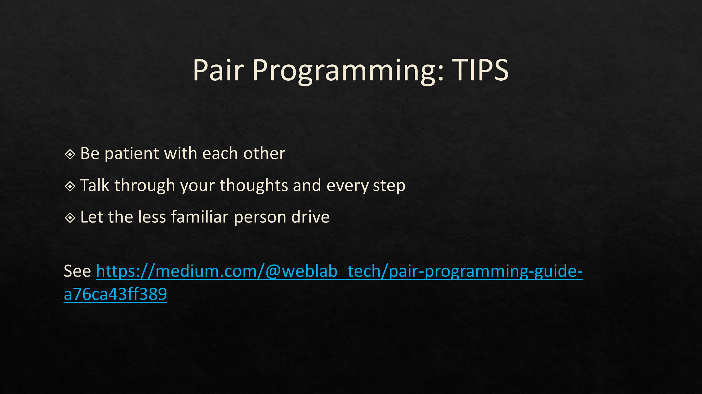</a>

Good pair programming depends on both people being good communicators and being patient with each other - both of which take a lot of practice.  The two of you should be talking together basically constantly.

I would recommend that the person that's less familiar with the codebase or feels less certain about the work drives most of the time. This can be a little bit intimidating at first, but will provide a huge learning opportunity to both of you. If the more experienced person is driving, it's very easy for them to lose the other one. With the less experienced person driving, the person driving will likely learn some programming tips from the other one while the observer will practice explaining their ideas in detail. In other areas you might have complementing strength and will learn from each other. You can switch who is driving, but I wouldn't switch very often. Instead, I'd talk through any stumbling blocks together.

### Slide 5: Navigating the code (3:06)
<a href="https://www.youtube.com/watch?v=p_2Uw2BxdhA">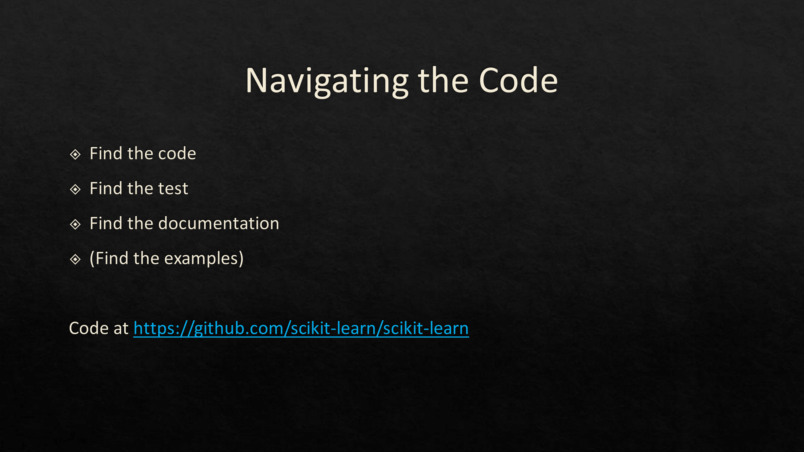</a>

Alright. So let's say you've found a partner and you have found an issue you want to work on. If you're both new to scikit-learn, it's a good idea to get oriented a bit. Generally, I think the conciseness of Python means it's pretty easy to manually navigate even complex code bases - but having some assistance from a programming tool helps. I used to code in Vim, but these days I'm using VSCode. I'll show you how to navigate the code base with it. You can do the same with any other IDE or editor though. 

### Demo 1: VSCode (3:41)
<a href="https://www.youtube.com/watch?v=p_2Uw2BxdhA">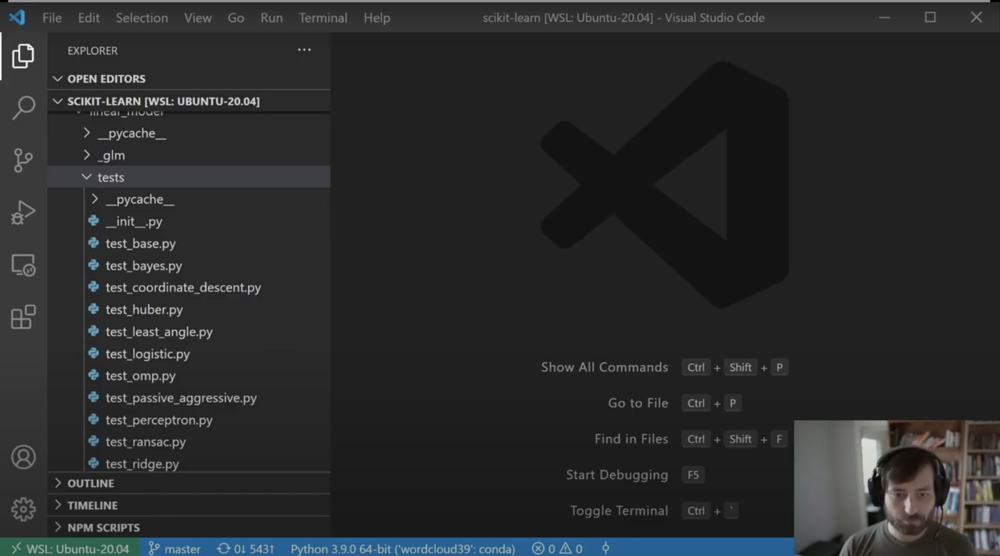</a> 

So here I opened the scikit-learn repository in VSCode. You can see all the files and folders on the left hand side. Usually a python project has a `setup.py` at the top level of the repository, which you can see here. And then there's the folder that contains the actual module which is `sklearn` in this case. Only code that is part of the library is going to be in this folder. Then there can be several other folders. Scikit-learn has become quite complex over the years and so there are a lot of folders. I don't want to go through all of them. 

Many of the files and folders actually set up various continuous integrations infrastructure and automatic pipelines for release of packages. That's, for example, `.circleci` and `.github` and many of the yaml files you'll see down here for Travis and Azure pipelines and so on. You're relatively unlikely in a sprint to touch any of these. You're more likely to work on two other folders that are related to the documentation, which are `examples` and `doc`. 

The `examples` folder contains example Python scripts that are also rendered to the website. As you can see, each of these folders here have several Python files in them. And the `doc` folder contains the code for the website and for all of the user guide. And I'll tell you a little bit more about this in a bit. 

The tests in scikit-learn are interweaved with the code in separate test folders. So, within the `sklearn` folder, you have a `tests` folder here. And within each of the subfolders, you have a `tests` folder that's specific to this particular submodule. For example, if you want to work on logistic regression, logistic regression is at the `sklearn/linear_model` folder. And so there's a file `_logistic.py` here that contains logistic regression. And the corresponding tests will be in the linear model folder in the subfolder `tests/test_logistic.py`. 

Alright. So now let's say you want to address a particular issue. 

### Demo 2: scikit-learn PR (6:08)
<a href="https://www.youtube.com/watch?v=p_2Uw2BxdhA">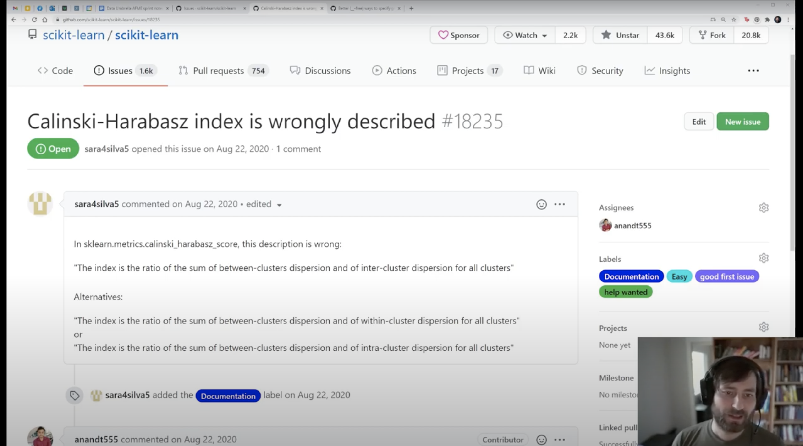</a> 

For example, this one here. In this issue, there's a complaint about docstring. So, this is a docstring of the Calinski-Harabasz score. Let's say we want to find this. 

### Demo 3: Search Function (6:30)
<a href="https://www.youtube.com/watch?v=p_2Uw2BxdhA">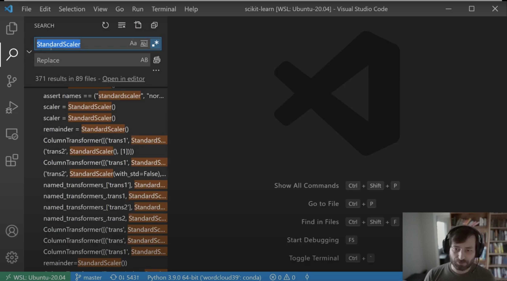</a> 

The easiest way to do this is to use the search function in your editor. If your editor doesn't have a search function, you can also just use `git grep`. Luckily this name is actually quite unique and so the search results are pretty small. Still it helps you to understand the different folders the results are in. So here are the `doc/modules`. This is the documentation: `sklearn/metrics`. This is the code, so it's the actual implementation. Then here, these are tests. We can also briefly, quickly find the definition by just by putting `def` in front of it. 

And so now we go to the actual code. The issue was about the docstring. In the docs, docstring is part of the documentation that is with the code. So here you have the function definition. And just after the function definition you have this string. This is what's going to be rendered in the API documentation on the website, which is unlike the user guide. The user guide is in the `doc` folder. And so now if you want to make a change, you could make the change here.

### Slide 7: Basics of Sphinx (7:58)
<a href="https://www.youtube.com/watch?v=p_2Uw2BxdhA">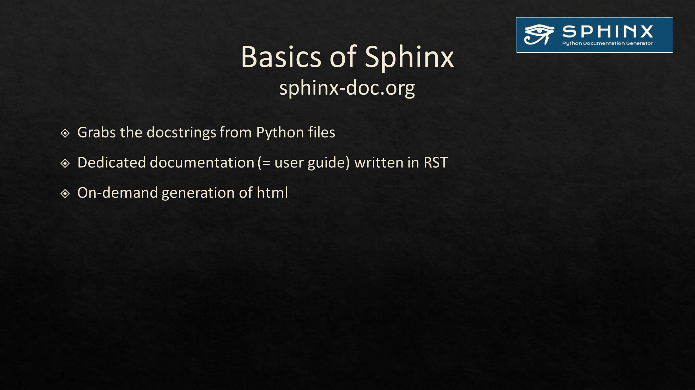</a>

Now let's get into the documentation and website a little bit more. The documentation is generated using a tool called Sphinx and is mostly written in a markup language called reStructuredText or RST. It's not a very common language outside of the Python documentation and it needs a little bit getting used to. 

All the files in the documentation folder - `doc` folder - are written in RST. They are parsed by the Sphinx tool, which then generates the website. Sphinx can also generate other outputs like PDFs, but usually we mostly use the HTML output for our website. Sphinx also reads part of the documentation that's inside the code. The docstrings that we saw are embedded with the function class definitions. These are then also rendered on the website. I said before, Sphinx also reads the examples and puts them on the website. So if you want to modify the part of the documentation that's part of your docstring, as I showed you, you have to do this in the source code itself. So everything that will be rendered in the API documentation is written in the source code itself. If you want to modify the user guide, this will be written in RST inside the `doc` folder. 

The docstring has a particular format - the `numpydoc` format. We have several other conventions ourselves. You can find all of these in the contributor guide.

### Slide 8: Updating your branch(es) (9:29)
<a href="https://www.youtube.com/watch?v=p_2Uw2BxdhA">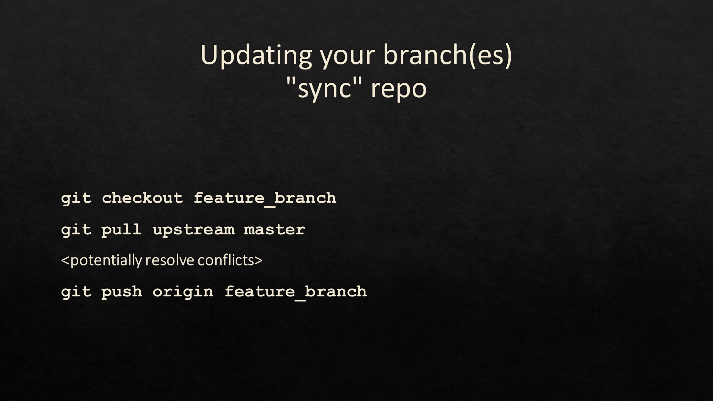</a>

All right. So, finally, I want to talk through two issues with git that people often struggle with. In the other videos, we already walked through the basic workflow, but there are two tasks that often come up that I want to highlight. 

During a sprint, there can be a lot of activity on the repository and the changes that the people make can be relevant to whatever you're working on. This might lead to conflicts or to you working on an outdated version of the code. Before you start anything and whenever GitHub shows you your branch is out of sync, you should update your feature branch to synchronize with the main repository. For that, make sure that you currently have your feature branch checked out with `git checkout feature_branch`, where feature branch is the name of your branch. Then assuming you have the main repository added as your remote called upstream, you can do `git pull upstream main` ~~`master`~~ to fetch and merge with the upstream main ~~master~~ branch. If there are any conflicts, you need to resolve them now. Then once the merge is complete you can push it - your feature branch -  to your fork (so the origin remote) with `git push origin feature_branch`. If you have a pull request based on your feature branch, the pull request will be updated automatically. 

### Slide 9: Branches and your second pull request (PR) (10:54)
<a href="https://www.youtube.com/watch?v=p_2Uw2BxdhA">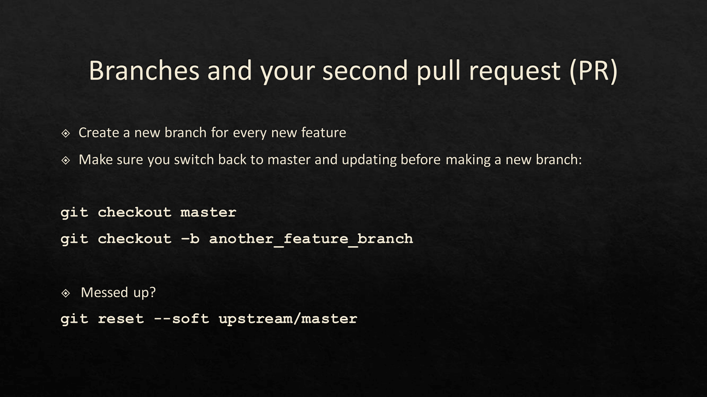</a>

The last thing I want to mention is a common but easy to avoid mistake when getting started with the GitHub workflow. So if you have followed the other videos, you know how to fork and pull a repo, create a branch, and make a first pull request. Then it usually takes a while for a contribution to be reviewed and you might want to start on your next issue. Remember that right now your folder reflects the content of your pull request. If you want to start on something else, make sure your base is on the current main ~~master~~ branch, not on your pull request. So check out your the main ~~master~~ branch and `git pull upstream main` ~~`master`~~ to have the current version of the main ~~master~~ branch. Then create a new branch with `git checkout -b another_feature_branch` from the main ~~master~~ branch - not from your feature branch. 

And just to be sure, whenever you create a new pull request, look at the `diff` that is shown on GitHub and check if it includes any changes that you didn't mean to include. If you find you have more changes than expected before creating the PR, you can go back and see if you can fix your branch. If you can - if you don't notice at first - you can still undo any changes and update your pull request by pushing to the branch again. One relatively easy way to rewrite your history is to do `git reset --soft upstream/main` ~~`master`~~. This will undo all of your commits, but will keep the files as they are so basically your history will roll back to the state of upstream main ~~master~~, but all your files will be however you change them.

From there you can selectively commit all the changes you want to commit, while leaving out anything that you don't want to include, then pushing again to your feature branch (potentially you need to force push), and then you can update your pull request. 

### Slide 10: Data Scientists (13:04)
<a href="https://www.youtube.com/watch?v=p_2Uw2BxdhA">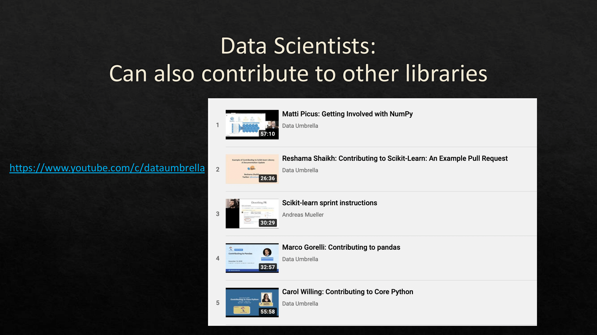</a>

That's all I had for the upcoming sprint. There are many other libraries that could use your help though and the Data Umbrella has curated a video series of how to contribute to several Python projects including numpy, pandas, and core python like scikit-learn. These are fairly big and established projects. If you're a seasoned developer contributing to such a project, it can be very gratifying. So please go and check out these videos. 

However getting a change accepted in a mature project can sometimes be challenging and you can also look for smaller newer projects that are less established. New projects are often easier to contribute to and are usually very enthusiastic if they get outside contributions. Might also provide more of an opportunity for you to collaborate in shaping the vision of the project. So make sure to check out a small project that you are using or interested in and see if they are looking for contributors or ask if you are unsure. There's often lots of interesting work to do and it's a great way to get involved with open source. That's it and I hope I'll see you at the sprint.

