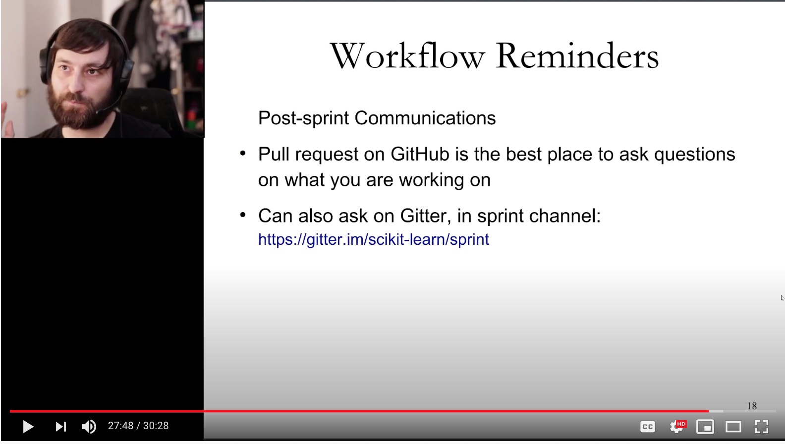
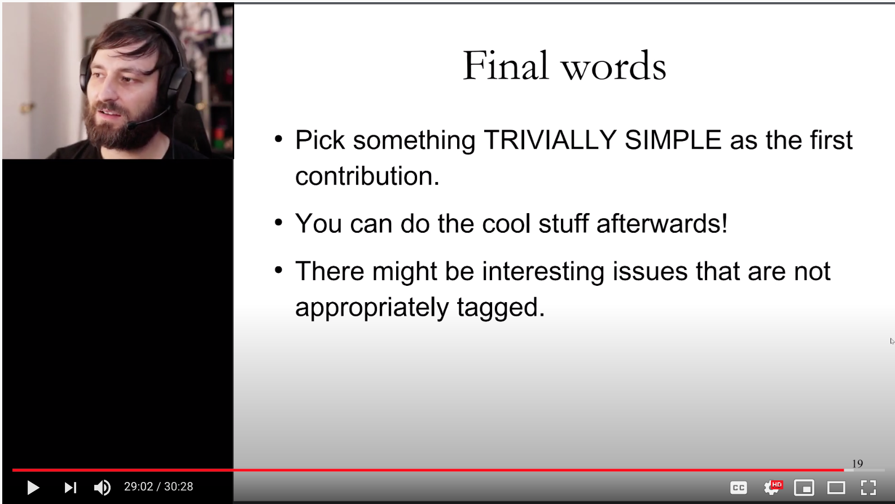
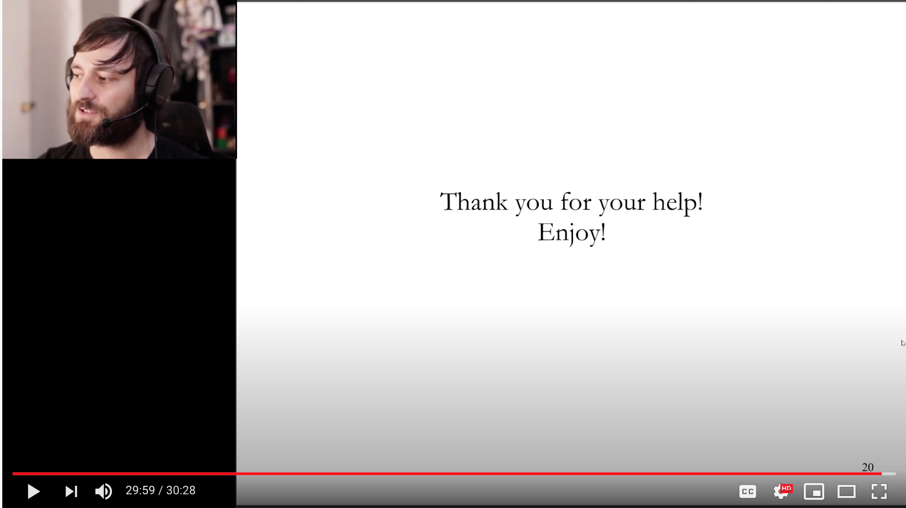

<p float="left">
 <a href="https://www.dataumbrella.org">  </a>
  
   <a href="https://github.com/scikit-learn" target="_blank">   </a>
</p>

# [Data Umbrella](https://www.dataumbrella.org): Curso Rápido para Contribuir com o [scikit-learn](https://github.com/scikit-learn)

## Transcrição do Vídeo

- Palestrante: [Andreas Mueller](https://twitter.com/amuellerml)
- Vídeo: [Scikit-learn Sprint Instructions](https://youtu.be/5OL8XoMMOfA) (30 minutos)
- Slides da apresentação (em PDF): [Crash Course in Contributing to Open Source Projects](https://github.com/data-umbrella/2020-sklearn-sprint/blob/master/data-umbrella-sprint-intro.pdf)
- Transcritor: [Reshama Shaikh](https://twitter.com/reshamas)

## Links importantes

- Data Umbrella [Discord](https://discord.gg/mEzEbYT)
- Gitter: [scikit-learn](https://gitter.im/scikit-learn)
- **[Fluxo de comandos para contribuição](contributing/workflow.md)** (Configuração do ambiente, repositório, submissão de Pull Requests)
- [Documentação para Contribuições para Scikit-learn](http://scikit-learn.org/stable/developers/contributing.html)

## Vídeo

<a href="https://youtu.be/5OL8XoMMOfA?t=1"></a>

---

### Slide 1: Introdução (0:00)

<a href="https://youtu.be/5OL8XoMMOfA?t=1"></a>

Olá, pessoal! Então, este é um vídeo introdutório sobre como contribuir para projetos de código aberto, especialmente para o scikit-learn. Meu nome é Andreas Mueller, um dos desenvolvedores principais do scikit-learn. Graças à Reshama ao Data Umbrella por organizar esta sprint. Então, eu almejo mostrar a vocês uma breve visão geral da tecnologia por detrás da contribuição ao código aberto e os primeiros passos para inserir suas contribuições.

### Slide 2: Instruções para o Sklearn (0:40)

<a href="https://youtu.be/5OL8XoMMOfA?t=40" target="_blank"></a>

Então, primeiramente, uma ótima forma de se comunicar outros desenvolvedores é através do canal do Gitter [gitter.im/scikit-learn](https://gitter.im/scikit-learn). Para a sprint há um canal chamado "sprint": [gitter.im/scikit-learn/sprint](https://gitter.im/scikit-learn/sprint). E também existe um canal scikit-learn é para assuntos gerais: [gitter.im/scikit-learn/scikit-learn](https://gitter.im/scikit-learn/scikit-learn). Durante a sprint nós também usaremos o Discord e ao longo da sprint talvez seja a melhor forma para se comunicar. Porém, ao final da sprint, os desenvolvedores principais não permanecerão no Discord, mas você sempre pode entrar em contato no Gitter para tirar dúvidas.

### Slide 3: Razões para Contribuir (1:24)

<a href="https://youtu.be/5OL8XoMMOfA?t=84" target="_blank"></a>

Então, você já se juntou a nós e, ou pelo menos está vendo este vídeo. Portanto, espero que você já esteja altamente motivado para começar a contribuir. Ainda assim, quero rever algumas razões pelas quais você talvez queira contribuir. Para muitas pessoas, trata-se de retribuir aos projetos que já estão utilizando. Portanto, os usuários dos projetos são geralmente os melhores colaboradores. E assim espero que os projetos de código aberto já o tenham ajudado em sua jornada de codificação e em seu trabalho e assim por diante. E contribuir de volta é uma ótima maneira de retribuir à comunidade. Também lhe dá uma grande oportunidade de aprender com as outras pessoas envolvidas em um projeto que muitas vezes são desenvolvedores seniores, o que lhe dará feedback sobre o estilo de codificação e também sobre como usar os diferentes projetos e como interagir. Ele também permite que você aborde questões.
que sempre o incomodaram sobre biblioteca, como consertar coisas, consertar documentação e apenas tornar os projetos melhores.

### Slide 4: Razões para Contribuir (2:33)

<a href="https://youtu.be/5OL8XoMMOfA?t=153" target="_blank"></a>

Além disso, você se poderá se familiarizar mais com as ferramentas da ciência dos dados se estiver contribuindo diretamente para projetos. Definitivamente contribuir com o código aberto também pode ser útil na busca de empregos, embora se esta for sua única motivação, pode não funcionar tão bem porque o código aberto é realmente sobre a comunidade. E a menos que você esteja realmente interessado no projeto, provavelmente não será capaz de ficar por muito tempo. Portanto, o que realmente nos interessa é devolver seus projetos, interagir com os outros colaboradores e apenas se divertir trabalhando nos projetos.

### Slide 5: Configurar o ambiente Python (3:16)

<a href="https://youtu.be/5OL8XoMMOfA?t=196" target="_blank"></a>

Portanto, agora vamos à parte técnica. Portanto, primeiro queremos falar sobre a montagem. Se você quer desenvolver um projeto Python, obviamente precisa primeiro ter uma instalação local. E assim, se você já tem um ambiente Python funcionando, tudo bem. Caso contrário, eu diria que basta instalar o Anaconda. Geralmente é a maneira mais fácil de se fazer isso. Se você já tem um ambiente de trabalho, certifique-se de não estar usando o sistema Python no OS X, mas que você está usando um ambiente separado para fazer seu desenvolvimento dentro. Se você já tem uma instalação Anaconda, basta criar um ambiente virtual separado para o sprint.

Portanto, eu dou aqui o comando que é `conda create -n` e lhe dei um nome para o ambiente, aqui o chamo de `sklearndev`. E então todos os pacotes dos quais ele dependerá: `numpy scipy matplotlib pytest sphinx cython ipykernel`. Portanto, na verdade, não estamos instalando o scikit-learn utilizando o conda. Nós vamos instalar a versão de desenvolvimento. E assim você pode ativar este ambiente usando `source activate sklearndev` ou `conda activate sklearndev`, eu acho que no Windows principalmente (estes comandos podem ser úteis).

```bash
conda create -n sklearndev numpy scipy matplotlib pytest sphinx cython ipykernel
source activate sklearndev
conda install -c conda-forge sphinx-gallery
```

Então, se você quiser trabalhar com documentação, você também precisa instalar o pacote sphinx-gallery. Isto não está no conda principal, então você precisa instalá-lo a partir do canal conda-forge usando `conda install -c conda-forge sphinx-gallery`.

### Slide 6: Dar fork (garfo) no projeto sklearn no GitHub (4:57)

<a href="https://youtu.be/5OL8XoMMOfA?t=297" target="_blank"></a>

Muito bem, então agora você tem seu ambiente python configurado. Você tem um ambiente separado para o desenvolvimento de scikit-learn. Agora você terá a mais nova versão de desenvolvimento de scikit-learn. Para fazer isso, primeiro você vai ao repositório principal de scikit-learn github.com slash scikit-learn, slash scikit-learn:[github.com/scikit-learn/scikit-learn](https://github.com/scikit-learn/scikit-learn)e você vai criar um fork (garfo). O fork é basicamente sua própria cópia pessoal do repositório no GitHub.

### Slide 7: Clonando o Fork (5:26)

<a href="https://youtu.be/5OL8XoMMOfA?t=326" target="_blank"></a>

Você pode fazer isso clicando no botão do garfo na parte superior, aqui mesmo. Isto criará seu fork pessoal e o levará até lá. Assim, você pode ver aqui em cima à esquerda este é meu fork, amueller barra scikit-learn. _Amueller_ é o meu handle (cabo) GitHub, então você terá seu handle (cabo) GitHub ali. E você pode ver que é um fork (garfo) de scikit-learn slash scikit-learn, o repositório principal.

Portanto, esta é agora sua própria cópia privada no GitHub. Então, esta cópia, você tem acesso por escrito e pode fazer mudanças nisto. A partir daí, você terá sua própria cópia local em sua própria máquina, clonando-a. E então há este clone de botão verde ou download que você pode ver aqui. Você clica nisto e pode copiar o link e fazer `git clone` com esta URL. E isto irá baixar uma cópia para sua máquina local, seu laptop ou PC. Quando você faz isto, uma coisa importante é que você utiliza HTTPS. Portanto, clique aqui e você deve usar HTTPS e obterá um endereço HTTPS. Estou usando SSH, o que é mais fácil se você tiver chaves SSH configuradas em sua máquina local. Se você não tiver tenha as chaves SSH configuradas e não as tenha colocado em sua conta GitHub e assim por diante, então use apenas HTTPS. Vai ser muito mais fácil. Uma vez que você baixou o repositório do seu clone, você também deseja adicionar o repositório principal como um upstream para que você possa baixar a versão mais recente do repositório upstream se alguém mais fizer mudanças. Você pode fazer isso dentro do seu repositório fazendo `git remote add upstream` e depois a URL depois do meu repositório, github.com barra scikit-learn slash scikit-learn ponto git:
https://github.com/amueller/scikit-learn.git

### Slide 8: Construindo e rodando os testes (7:25)

<a href="https://youtu.be/5OL8XoMMOfA?t=443" target="_blank"></a>

Muito bem, então agora você tem sua cópia local da versão de desenvolvimento do Scikit-learn e agora queremos instalá-la. Portanto, queremos construí-la e instalá-la. E a maneira mais fácil é ir para a pasta que você acabou de clonar e fazer a instalação do pip - e ponto: `pip install -e .` Isto faz uma instalação que faz o edifício e vamos adicioná-lo ao seu caminho Python. O - e torna-a uma instalação edible, editável (não edible), em uma instalação editável. O que significa que se você alterar os arquivos nesta pasta, ela será automaticamente refletida em sua instalação. Isto irá sobrescrever as instalações existentes, portanto, certifique-se de que você não tenha uma instalação de scikit-learn. Portanto, assegure-se de fazer `conda desinstalar o scikit-learn` neste ambiente se você o instalou acidentalmente mais cedo.

#### Windows (8:14)

Se você estiver no Windows para instalá-lo, você precisará de um compilador C++, então você precisa instalar o kit de ferramentas Visual Studio. E se você tentar faça a instalação através do `pip install` - e ponto, provavelmente lhe dará uma mensagem de erro. A mensagem de erro lhe dirá exatamente o que baixar e onde. Para o OS Access Linux, você provavelmente já terá o compilador instalado, portanto não precisa se preocupar com isso. Assim, você terá sua instalação de construção, sua nova instalação do ramo de desenvolvimento do scikit-learn.

### Slide 9: Começando em Issues (Assuntos) (8:50)

<a href="https://youtu.be/5OL8XoMMOfA?t=530" target="_blank"></a>

Agora você terá que escolher uma issue para começar a trabalhar. Portanto, falarei um pouco mais sobre isto mais tarde, mas selecionamos algumas das questões, então talvez seja mais fácil escolher uma delas. Você encontrará uma URL aqui. Espero que você baixe os slides para não ter que digitar tudo isso. Depois comente sobre o assunto, diga "Estou trabalhando nisto" ou há também um comando agora onde você pode simplesmente dizer "take" e o bot atribuirá o assunto a você. Antes de começar a trabalhar, certifique-se de ter a versão mais atual do master upstream, portanto, fora do repositório principal. Você pode fazer isso fazendo `git pull upstream master`. É por isso que adicionamos o repositório upstream mais cedo.

#### Buscando as PR's (pull requests) de outra pessoa (9:38)

Se você quiser começar a partir de um pull request de outra pessoa, onde ela já começou algum trabalho mas depois parou, e depois você quer terminá-lo, você pode obter o código deles usando este comando aqui embaixo o `git fetch` e depois adicionar uma url ao repositório deles e depois o nome da branch (ramo) deles, dois pontos, qualquer nome de branch (ramo) que você queira usar localmente.

`git fetch https://github.com/theirusername/reponame.git theirbranch:ourbranch`

### Slide 10: Começando em Issues (9:59)

<a href="https://youtu.be/5OL8XoMMOfA?t=600" target="_blank"></a>

Portanto, antes de começar a programar, você quer criar uma nova branch para seu recurso. Você pode fazer isso fazendo o git checkout traço b (`git checkout -b <branchname>` ) e depois um nome para sua branch.

Você não deve trabalhar em sua ramificação principal (main/master branch). Você não deve fazer mudanças em sua main branch. Você deve sempre trabalhar em uma branch de recursos (branch feature). Assim, por exemplo, se você quiser melhorar a documentação para random forests, você pode fazer checkout - b random forests traço docs ou algo assim (`git checkout -b randomforests_docs'). Isto é principalmente para você, mas é útil se tiver como um nome compreensível.

Então você fez suas mudanças. Falaremos um pouco mais detalhadamente sobre isso. Então você corrige alguns bugs ou melhora a documentação, o que quer que você queira fazer. Depois, você faz os testes com o "sklearn depytest". O "sklearn depytest" executará todos os testes. Você também pode executar apenas arquivos de teste individuais, se quiser. E, finalmente, execute o 'flake8' em todos os arquivos alterados. Portanto, o `flake8` é uma ferramenta de laminação (linting tool). Ele lhe mostrará erros de formatação e como declarações não utilizadas e assim por diante. Se você não fizer isso, provavelmente haverá problemas mais tarde, na integração contínua, e você definitivamente terá que corrigi-los antes que possamos dar merge seu pull request.

### Slide 11: Criando um PR (11:20)

<a href="https://youtu.be/5OL8XoMMOfA?t=680" target="_blank"></a>

Então agora, digamos que você conserte as issues que deseja consertar. Você os comprometeu localmente em sua filial e você faz os testes e corre osflake8 e tudo passa. Então você pode dar push nas mudanças que fez localmente para seu repositório GitHub usando o git push origin e depois o nome de sua branch. Isto o empurrou para seu fork, portanto para sua cópia pessoal do Scikit-learn no GitHub. Então, para colocá-lo no repositório principal, você faz o que é chamado de "pull request", que basicamente pede aos desenvolvedores que levem suas mudanças e as integrem no repositório principal. Você pode criar um pull request, indo para o repositório principal scikit-learn barra scikit-learn, e se você pressionar para seu repositório, você verá este botão verde aqui dizendo comparar e dar pull request.

### Slide 12: Describing PR (12:17)

<a href="https://youtu.be/5OL8XoMMOfA?t=739" target="_blank"></a>

Assim, isto o levará a uma interface onde você pode criar um pull request. Ela preencherá automaticamente as coisas aqui no topo que basicamente dirão do seu fork, sua branch, que você quer fazer um pull request para a branch main/master do Scikit-learn. Mas isso normalmente será preenchido automaticamente para você. O que você tem que fazer é primeiro dar-lhe um título. Se você quiser, você pode prefaciar o título por MRG, se você acha que seu trabalho está pronto para ser revisado e fundido. Ou WIP, se você acha que é um trabalho em andamento, o que significa que você ainda precisa querer fazer algumas mudanças. Você só quer mostrar o trabalho que fez até agora. Você normalmente quer dar a isto um nome descritivo, para que alguém possa ler e saiba exatamente no que você está trabalhando. Portanto, lembre-se que o scikit-learn é grande e, portanto, se você diz mudança no atributo de uma classe, e você não diz em qual modelo está, isto pode não ser útil. Portanto, seja preciso e específico, mas não se estenda demais. Se você se referir a uma issue que você está corrigindo no título, GitHub na verdade não irá vinculá-lo. Mas por isso é muito importante que você faça referência a qualquer issue que você esteja consertando ou que você a escreva ou qualquer pull request que você esteja prestes a realizar, na descrição do pull request. Portanto, aqui, você quer dizer "conserta issue x". Há algumas palavras mágicas no GitHub que significam que se você disser "Fix x" ou "Close x", e então o pull request é fundido, GitHub fechará automaticamente como um pull request. Portanto, se você estiver consertando completamente algo que é um problema, diga "Fix this issue" e então os pull requests serão automaticamente fechados. Se você está consertando apenas parte de um issue, ou se seu issue tem como muitas pequenas partes, e você está fazendo uma delas, por favor, não diga "conserta o issue" ou "fecha o issue" porque então se sua coisa for mesclada (merge), o GitHub fechará automaticamente todo o issue para todos. E então para alguém mais reabri-la [a issue] se ela estiver atual. Portanto, use o número da issue de conserto, mas somente quando for apropriado e definitivamente mencionar qualquer issue ou pull request.

**Observação:** Talvez você queira usar "References issue #xxxxx" (ao invés de "fixes" ou "closes")

### Slide 13: Testes de Regressão (14:45)

<a href="https://youtu.be/5OL8XoMMOfA?t=887" target="_blank"></a>

AMuito bem, então digamos que você abriu seu pull request. Então, na parte inferior, você verá a suíte de integração contínua [CI] funcionando. Portanto, os diagramas serão um pouco diferentes hoje em dia, porque estamos usando principalmente pipelines da Azure. E assim você quer que todos estes checkboxes estejam verdes. Caso contrário, você pode clicar nos detalhes e isso lhe dirá o porquê do teste estar falhando. E isto lhe dirá, esperançosamente, o que você precisa abordar. Se isto não estiver claro para você, basta fazer uma pergunta sobre o pull request ou sobre o issue tracker (rastreador de problemas) em qualquer lugar e as pessoas ficarão felizes em ajudá-lo a esclarecer o que é que você precisa consertar para que um teste seja aprovado.

Também não é suficiente que os testes que estavam lá antes de seu código ser aprovado. Sempre que você muda o código, você também quer adicionar um teste que teste o código que você adicionou. Se você consertar o bug que é chamado de teste de regressão. Mas também se você adicionar um recurso, você definitivamente quer adicionar um teste que teste o recurso. Nós não daremos merge em nenhum pull request sem um teste. E assim, basicamente se você fez alguma mudança no código, é muito provável que você também precise fazer uma mudança em seus testes ou fazer uma adição aos testes. Se você não souber qual arquivo de teste deve ser examinado, provavelmente poderá fazer um git grep para encontrá-lo. Se não apenas pergunte em qual arquivo ele tem que ir ou o que deve ser testado.

### Slide 14: O que vem a seguir? (16:15)

<a href="https://youtu.be/5OL8XoMMOfA?t=975" target="_blank"></a>

Muito bem, então digamos que você editou seus testes. Todos os testes passaram. Tudo lindo. O que vem a seguir? Então você provavelmente receberá revisores dos core developers (desenvolvedores do núcleo). Pode levar algum tempo, particularmente durante a sprint, porque as pessoas estão bastante ocupadas. Normalmente, os revisores terão comentários. É muito incomum que alguém diga "oh seu pull request é ótimo, podemos simplesmente dar merge nele". A revisão do pull request é uma parte muito, muito importante do código aberto, e é a principal forma de discutir novas funcionalidades. Portanto, não fique desapontado se alguém disser "bem, eu realmente acho que devemos fazer desta ou daquela maneira". Esta é realmente a principal forma de comunicação dos desenvolvedores. E assim não é como se eles estivessem rejeitando seus pull requests. Basicamente, todos os pull requests passam por mudanças.

Eu estou com o projeto há muito tempo e basicamente qualquer pull request que eu fizer terá uma longa discussão e passará por muitas iterações antes de ser fundido, _ se_ for fundido. E assim, se você estiver menos familiarizado com o projeto, provavelmente será necessário fazer ainda mais iterações. E assim isso é completamente normal e é a maneira que você aprenderá sobre as práticas do projeto e também como você aprenderá a melhorar seu estilo de codificação. Para tratar de qualquer comentário, você pode simplesmente atualizar a branch que você tem localmente e dar push para seu fork. Isso atualizará automaticamente a pull request. Assim você não precisará fechar a pull requests e abrir uma nova pull request. A pull request será atualizada automaticamente com quaisquer mudanças que você tenha. Isto provavelmente voltará algumas vezes e então, quando os revisores estiverem satisfeitos, eles aprovarão a solicitação de puxar ou talvez mudarão o título para dar merge em mais um ([MRG + 1]).0

Mas eu acho que hoje em dia normalmente usamos o recurso de aprovação do GitHub. Você precisa de duas aprovações dos desenvolvedores do núcleo de scikit-learn, então estas são pessoas com direitos de commit no repositório do scikit-learn. Uma vez que você tenha duas aprovações, provavelmente seu pull request será fundido. Às vezes pode levar algum tempo para obter revisões, portanto, seja paciente. Mas você também pode se sentir à vontade para fazer ping e pedir revisões. Assim, para chamar os desenvolvedores sobre o seu pull requests ou em um bate-papo ou pessoalmente. Bem, pessoalmente é difícil hoje em dia, mas é como em qualquer plataforma online que estivéssemos colaborando.

### Slide 15: Encontrando Issues (18:52 )

<a href="https://youtu.be/5OL8XoMMOfA?t=1132" target="_blank"></a>

Um aspecto que eu acho bastante importante é encontrar issues para trabalhar. Portanto, o ideal é encontrar algo em que você esteja interessado, mas também deve começar com algo que seja realmente, realmente simples. Se esta é sua primeira contribuição de código aberto ou mesmo se é sua primeira contribuição para o projeto Scikit-learn; mesmo se você já contribuiu para outros projetos antes, _realmente_ comece com algo super simples. Como você deve ter notado, há muito processo para tudo isso como trabalhar com Git, trabalhar com a integração contínua (CI) trabalhando com os revisores, e assim por diante. E assim, mesmo que seja apenas uma única mudança de código de linha ou uma única mudança de documentação de linha, pode ser realmente útil. E é importante fazer uma pequena coisa para se atualizar e conseguir a fusão. Antes de atacar qualquer coisa grande, ainda faça algo simples primeiro.

Como eu disse antes, há esta coisa que está ligada aqui no fundo onde colocamos algumas questões que são especificamente marcadas para este sprint. Portanto, tudo isso é provavelmente muito bom. Além disso, há tags no repositório. A tag mais importante talvez seja uma boa primeira questão. As questões de "boa primeira edição" são boas se você não tiver contribuído para o aprendizado de scikit-learn antes e isso deve ser muito fácil e direto. As coisas que precisam de alguém para trabalhar nelas devem ser etiquetadas com "need contribuitor" (precisa-se de colaboradores), embora isso possa às vezes estar desatualizado. Mas você deve verificar as coisas que são boas em primeiro lugar e que precisam de contribuinte.

Há também coisas que são marcadas com "fácil" ou "sprint". Por mais que issues "easy" possam ser mais fáceis, mas talvez não sejam boas para os primeiros colaboradores ou às vezes podem ter ambas as tags.

Portanto, há também outras maneiras de contribuir e depois encontrar uma issue e trabalhar neles. Você também pode simplesmente consertar algo nos documentos que não esteja claro. Você não precisa necessariamente abrir um problema para isso, assim como melhorar a documentação se houver algo que você não goste sobre isso. Ou apenas abrir issues. Questões em aberto sobre documentos pouco claros, sobre recursos que você acha estranho, sobre exemplos que não são úteis, sobre bugs que você encontra.

Portanto, um sprint pode ser uma grande oportunidade para abrir questões sobre coisas que você não gosta nos projetos, issues com os quais você se depara. E ter esse feedback é realmente, realmente importante para melhorar o projeto.

Outra coisa que você pode fazer é encontrar pull requests que outra pessoa fez, mas não terminou. Portanto, se houve revisões feitas pelos desenvolvedores, mas depois de um ou dois meses as pessoas não voltaram e resolveram seus issues, geralmente assumimos que o problema está pronto para ser resolvido. É educado perguntar, mas eles podem não ter tempo para responder no tempo que leva para isso, como no único dia do sprint. Portanto, ou basta perguntar: "você ainda está trabalhando nisto?" ou em algum caso pode ser bom começar a trabalhar nisto e dizer "ok, parece que você não está mais trabalhando nisto, eu assumo o controle".

Nesta e em qualquer outra comunicação sobre o rastreador de issue, é claro, seja sempre agradável, seja cortês, produtivo e construtivo em seu feedback..

### Slide 16: Revisando (22:22)

<a href="https://youtu.be/5OL8XoMMOfA?t=1342" target="_blank"></a>

Você também pode começar a revisar. Em particular, a revisão de pull requests ou de issues abertas por outras pessoas no sprint pode ser útil porque normalmente estão em um nível mais introdutório. Mas você pode tentar revisar quaisquer pull requests. A revisão de issues pode ser um pouco mais simples. Portanto, se você quiser verificar um problema, você pode procurar:

- esta issue é reproduzível?
- está claro o que a pessoa está relatando?
- eles deram o exemplo mínimo reprodutível?
- se sim, você pode reproduzi-la em sua máquina?
- eles forneceram dados?
- se eles não puderam fornecer os dados, eles poderiam reproduzi-los com um exemplo hipotético?

E assim, estas são mais ou menos todas as coisas que precisam estar presentes. Se eles não estiverem presentes, você pode pedir à pessoa que abriu a issue que os forneça. Se algo não estiver claro sobre a issue, sinta-se à vontade para esclarecer ou pedir esclarecimentos, quero dizer. E então você pode tentar reproduzir a issue. Portanto, basta reproduzi-la e certificar-se de que é fácil reproduzi-la, já é bastante útil. Algumas das issues já podem estar corrigidas e, portanto, você pode dizer que "oh isto já está corrigido nesta versão, porque temos issues muito antigas que remontam a vários anos atrás". Portanto, a triagem de issues é uma coisa muito útil a fazer. Alguns bugs não são confirmados para que você possa ver se pode confirmar e sob quais condições.

Você também pode revisar os pull requests para verificar se eles estão claros. A comunicação é clara? Você também pode revisar as mudanças de código. Eles têm testes adicionados? Eles aderem aos estilos? A integração contínua é aprovada? E então talvez tenham mencionado a issue que estão abordando em sua descrição? Então, todas as coisas que eu disse que você deveria fazer para seu pull request, você poderia verificar, são as outras pessoas no sprint ou geralmente qualquer pessoa que tenha um pull request. Eles estão aderindo a estas normas? Se não, você pode pedir a eles que o façam. É claro, seja sempre gentil e educado. Você também pode tentar rever as mudanças de código para ver se eles estão realmente tratando do que eles querem tratar? E eles estão abordando isso de uma maneira que você acha que é boa? Isto pode ser um pouco mais complicado, mas você deve definitivamente tentar. E se algo não estiver claro, basta pedir para esclarecer. E também não hesite em dar feedback. Apenas seja sempre como educado ao dizer, como oh talvez eu tivesse feito desta maneira, há alguma razão para você fazer desta maneira, e não dizer que não diga como oh esta é uma má maneira de fazer isto você, deveria fazer desta maneira. Provavelmente há uma razão pela qual alguém o fez da maneira que o fez, apenas seja sempre simpático e apenas peça esclarecimentos em vez de assumir.

### Slide 17: Lembretes do Fluxo de Trabalho (25:25)

<a href="https://youtu.be/5OL8XoMMOfA?t=1524" target="_blank"></a>

Um par de coisas sobre o fluxo de trabalho durante a sprint. Portanto, você é altamente encorajado a fazer programação em pares. Acho que é muito mais divertido e você pode fazer muito mais durante a programação em pares. Desta vez, será programação de pares remota usando o Discord. Talvez não seja tão bom quanto fazer programação em pares pessoalmente, mas acho que ainda é muito divertido. Se você estiver fazendo um pull request ou criando uma issue apenas @ mencione a outra pessoa que está trabalhando nisso para que todos eles recebam um ping em seus e-mails. Certifique-se de acompanhar o seu trabalho. Portanto, espere que haja muita conversa e discussão e, portanto, certifique-se de que você pegue todas as críticas que receber sobre seus pull requests. E realmente é importante pedir ao projeto para que você realmente consiga dar merge nas suas contribuições e assim realmente tente obter um acompanhamento durante a sprint, mas também idealmente um acompanhamento após a sprint. Realmente o que mais gostamos é encontrar novos colaboradores que continuem voltando para o projeto e continuem voltando a contribuir. Será mais fácil e mais satisfatório contribuir para o projeto quanto mais você se envolver e mais familiarizado você se tornar.

Você será capaz de fazer mais e mais coisas interessantes. Você será capaz de acrescentar novos recursos legais ao projeto e assim por diante. E assim também é realmente uma maneira de crescer com o projeto e aprender muito mais, tornando-se mais comprometido a longo prazo.

Portanto, provavelmente tentaremos fazer alguns eventos de acompanhamento para as sprints (follow-up). Caso contrário, sinta-se à vontade para acompanhar o rastreador de issues (issue tracker). O rastreador de issues é realmente a principal forma de comunicação dos desenvolvedores. Há também uma comunidade que se reúne mensalmente, através de uma chamada mensal que você pode participar se quiser. Junte-se à lista de e-mails ou simplesmente fale conosco no Gitter. E assim, sim, certifique-se de saber qual endereço de e-mail você usa em sua conta GitHub e verifique esse endereço de e-mail para notificações ou verifique as notificações diretamente no GitHub.

### Slide 18: Lembretes do Fluxo de Trabalho (27:44)

<a href="https://youtu.be/5OL8XoMMOfA?t=1666" target="_blank"></a>

Por isso eu disse que talvez haja algumas coisas a fazer que você não pode terminar durante a sprint. É realmente ótimo se você puder acompanhar e fazer com que seus pull request sejam fundidos. Então o pull request e o GitHub é realmente a melhor maneira de se comunicar e esta é uma discussão pública onde todos os desenvolvedores principais ou qualquer outra pessoa na internet podem responder perguntas e ajudar. E como eu disse antes, usaremos o Discord durante a sprint, mas os desenvolvedores do núcleo provavelmente não estarão presentes no Discord a maior parte do tempo após a sprint. Portanto, uma boa idéia é ir no canal sprint do Scikit-learn ou apenas no canal geral do Scikit-learn ou apenas conversar sobre as issues e pull requests.

Portanto, realmente estamos enfatizando que é uma boa idéia começar com algo realmente muito simples como uma primeira contribuição e depois trabalhar a partir daí. Minha primeira contribuição ao scikit-learn foi consertar alguns erros de digitação em nossa documentação. E se eu começar a contribuir para qualquer outro projeto, geralmente a primeira coisa que faço é como consertar uma linha na sua documentação e apenas, você sabe, começar a se comunicar e começar a entrar no fluxo de trabalho.

### Slide 19: Considerações Finais (29:00)

<a href="https://youtu.be/5OL8XoMMOfA?t=1709" target="_blank"></a>

Sim, então se você quiser acrescentar uma característica importante ao scikit-learn, isso provavelmente não é algo que você possa fazer em um dia. Adicionar um novo modelo ao scikit-learn é normalmente algo que leva muitos meses e não é algo que você deve tentar fazer no início. Portanto, comece realmente com algo simples e depois talvez se você receber seus dois primeiros pull requests e puder trabalhar para adicionar como um recurso menor, mas não conte em adicionar um recurso grande tão cedo. Isso porque scikit-learn já é uma biblioteca bastante madura e por isso está se movendo muito lentamente. E por isso é difícil adicionar algo grande ou fazer grandes mudanças. Também pode haver muitas questões interessantes que não estão devidamente marcadas. Portanto, se você estiver interessado em um tópico em particular, basta pesquisar o tópico no rastreador das issues ou nos pull requests e ver se há algo interessante acontecendo lá.

### Slide 20: Obrigado (29:59)

<a href="https://youtu.be/5OL8XoMMOfA?t=1797" target="_blank"></a>

Portanto, com isto quero dizer que aproveitem o sprint e obrigado a todos pela ajuda e espero que se divirtam muito. Vocês aprenderão muito trabalhando em conjunto com seu parceiro de sprint. E espero que voltem para mais sprints ou simplesmente continuem a se engajar no rastreador de issues. Muito obrigado!
